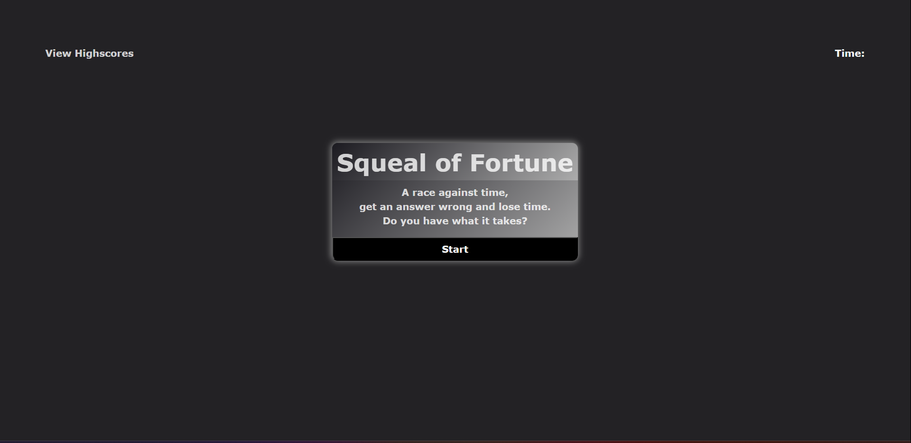

# Squeal-of-Fortune

## Description

This is a Timed Javascript Quiz coded using HTML, CSS, and JavaScript. It has score keeping capabilities as well as a timer that is reactive to your answer choices. I'm not extremely satisfied with the way the score-keeping is implemented and plan to change it in the future to reflect the actual grade as well as the time left to make the leaderboard more dynamic.

Here is a link to the deployed site on GitHub:

https://robertc91.github.io/Squeal-of-Fortune/

As well as an image showcasing the Start Screen of the page:

## Installation

There are no installation requirements for this application.

## Usage

When presented with the home start screen you click Start, you are then taken to the actual quiz where you will be penalized for getting questions wrong. It is a challenge but also tool to test your knowledge of JavaScript basics.

## License

MIT License